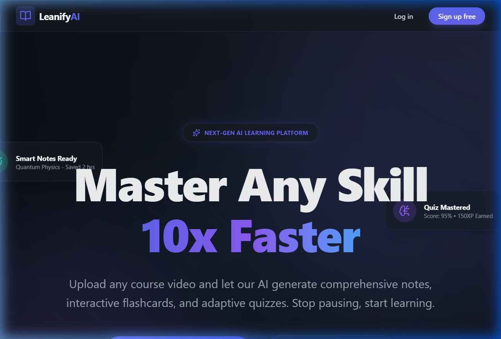
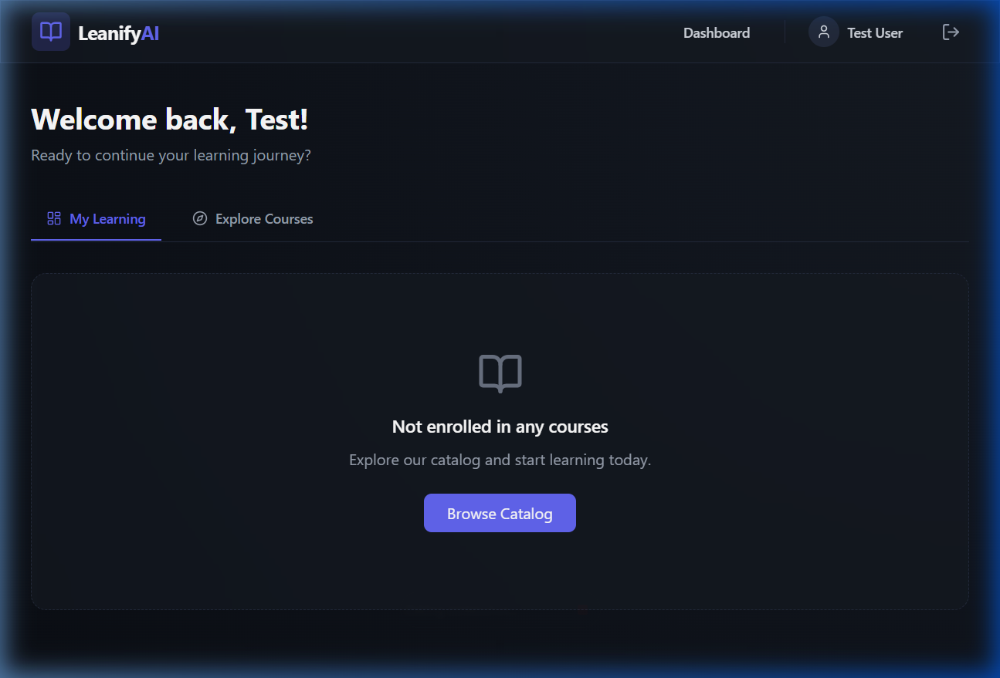
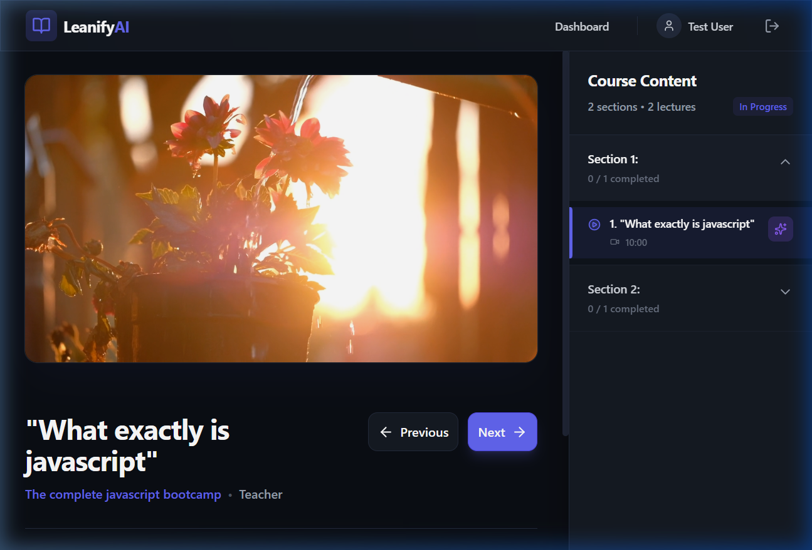
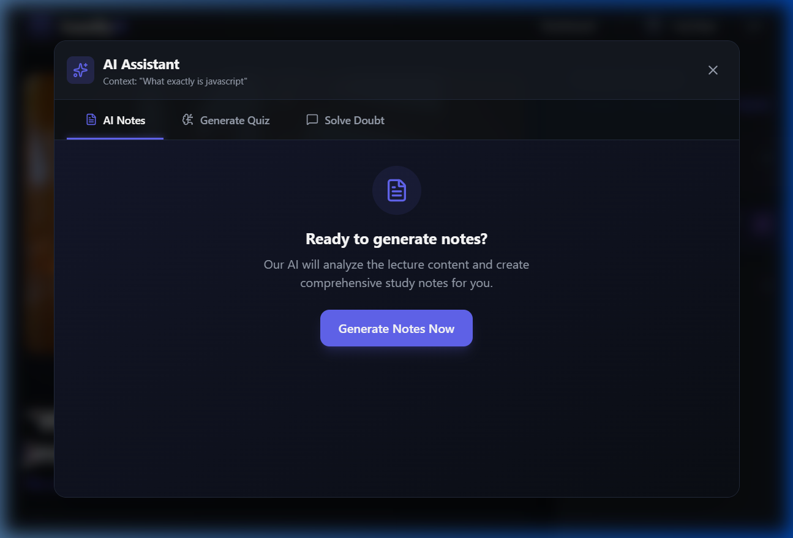
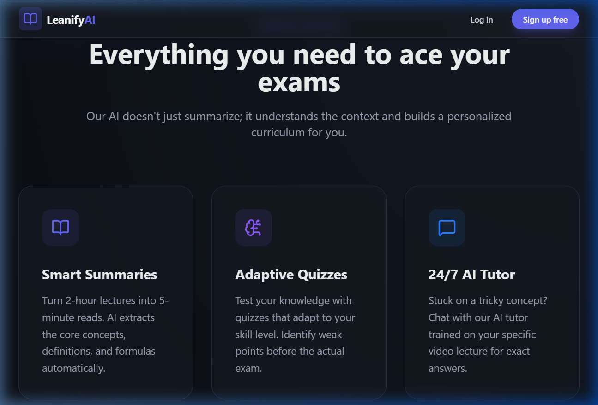

# Learnify AI - AI-Powered EdTech Platform


## 🚀 Overview

**Learnify AI** is a state-of-the-art, AI-driven educational platform designed to revolutionize the way students learn and teachers create content. By leveraging advanced AI models, Learnify provides personalized learning experiences, automated note generation, interactive quizzes, and instant doubt resolution.

**Live Demo:** [learnify-ai-powered.netlify.app](https://learnify-ai-powered.netlify.app/)

---

## ✨ Key Features

### 🤖 AI-Powered Learning Assistant
- **AI Notes:** Instantly generate comprehensive, structured notes for any lecture video.
- **AI Quiz:** Challenge yourself with dynamically generated quizzes based on course content.
- **AI Doubt Solver:** Get instant answers to your questions with a context-aware AI tutor available 24/7.

### 🖼️ Visual Tour

#### ✨ Stunning Landing Page


#### 📊 Personalized Student Dashboard


#### 📺 Interactive Course Player


#### 🤖 Context-Aware AI Assistant (Notes & Quizzes)


#### 🧩 Features Overview


### 🚀 AI Workflow: 3 Steps to Mastery

1. **Watch & Learn:** Stream high-quality educational videos in our custom course player.
2. **Generate & Review:** With one click, our AI extracts core concepts and generates structured notes for you to review.
3. **Test & Refine:** Take an AI-generated quiz to identify knowledge gaps and use the AI Tutor to clear doubts instantly.

### 🎓 For Students
- **Interactive Course Player:** Seamlessly watch lectures with a sleek, distraction-free interface.
- **Progress Tracking:** Monitor your learning journey through an intuitive dashboard.
- **Personalized Profile:** Manage your account and keep track of your enrolled courses.

### 👨‍🏫 For Instructors
- **Course Creation Suite:** Effortlessly build courses with chapters and video lectures.
- **Teacher Dashboard:** Detailed analytics on student enrollment and course performance.
- **Cloud-Integrated Media:** Robust video and image management via Cloudinary.

---

## 🛠️ Tech Stack & Architecture

### 🧠 AI Core
- **Model:** Google Gemini Pro
- **Capability:** Large context window allowing for deep understanding of long lecture transcripts.
- **Integration:** Context-aware prompt engineering for personalized student help.

### 🎨 Frontend
- **Framework:** React 19 (Vite)
- **Styling:** Tailwind CSS 4.0 (for high-performance, modern UI)
- **State Management:** React Hooks & Context API
- **Icons:** Lucide React
- **Notifications:** React Hot Toast
- **PDF Export:** jsPDF & html2canvas (Export your AI-generated notes!)

### ⚙️ Backend
- **Runtime:** Node.js / Express
- **Database:** MongoDB (Mongoose)
- **Authentication:** JWT (JSON Web Tokens) & BcryptJS
- **File Handling:** Multer & Cloudinary (Direct video streaming support)

---

## 📂 Project Structure

```text
├── controllers/          # API Route Controllers
├── models/               # MongoDB Schemas
├── routes/               # Express Routes
├── utils/                # Helper Functions
├── frontend/             # React Application
│   ├── src/
│   │   ├── components/   # Reusable UI Components (AIModal, Quiz, etc.)
│   │   ├── pages/        # Main Application Pages
│   │   ├── services/     # API Integration
│   │   └── App.jsx       # Main App Component
├── server.js             # Backend Entry Point
└── package.json          # Project Dependencies
```

---

## ⚙️ Getting Started

### Prerequisites
- Node.js (v18 or higher)
- MongoDB Atlas Account
- Google Gemini API Key
- Cloudinary Account

### Installation

1. **Clone the repository:**
   ```bash
   git clone https://github.com/your-username/learnify-ai.git
   cd learnify-ai
   ```

2. **Backend Setup:**
   ```bash
   npm install
   # Create a config.env file in the root and add your variables
   npm run dev
   ```

3. **Frontend Setup:**
   ```bash
   cd frontend
   npm install
   npm run dev
   ```

### Environment Variables
Create a `config.env` in the root directory:
```env
PORT=5000
MONGO_URI=your_mongodb_uri
JWT_SECRET=your_secret_key
GEMINI_API_KEY=your_gemini_key
CLOUDINARY_CLOUD_NAME=your_name
CLOUDINARY_API_KEY=your_api_key
CLOUDINARY_API_SECRET=your_secret
```

---

## 🤝 Contributing
Contributions are welcome! Please feel free to submit a Pull Request.

## 📄 License
This project is licensed under the ISC License.

---

<p align="center">
  Made with ❤️ by <a href="https://github.com/anubhavsha45">Anubhav Sharma</a>
</p>
